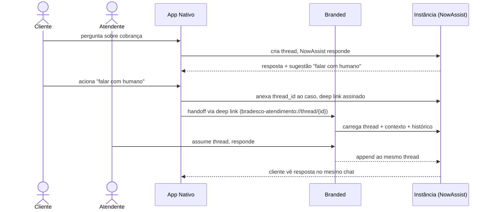

# Integration with Now Mobile — peça central

> Este documento explica **como os apps nativos Bradesco/Itaú vivem dentro do ecossistema oficial ServiceNow Mobile**, e não como produtos isolados. Leitura obrigatória para qualquer agente, desenvolvedor ou stakeholder.

---

## TL;DR

Os apps Bradesco/Itaú (binários próprios, App Store própria) são uma **extensão nativa do ecossistema ServiceNow Mobile**, conectada por 5 pontos:

1. **NowSDK embarcado** — telemetria, NowAssist chat, theming, services-of-platform.
2. **Backend único na instância** — Scripted REST versionado em `x_bank` scoped app, ACLs, consent model.
3. **Companion branded app via Mobile Publishing** — jornadas operacionais, atendimento delegado, Workspace mobile.
4. **Deep linking bidirecional** — Universal Links + custom schemes para handoff de jornada.
5. **IdP + NowAssist compartilhados** — continuidade de sessão e de contexto conversacional entre canais.

A separação dos dois apps existe por motivos de UX (banco de varejo) e governança (binário do banco passa em App Review do banco). A integração ao ecossistema oficial vem por embed e por contrato, não por share-binário.

---

## 0. Estratégia de app: padrão configurado vs binário próprio

A informação operacional sobre baixar o Now Mobile ou ServiceNow Agent e configurar a experiência via Mobile App Builder é correta e muda a arquitetura de entrega: existem dois trilhos, não um único app tentando resolver tudo.

| Trilha | Use quando | Como customiza | Limites |
|---|---|---|---|
| **App padrão ServiceNow** (`Now Mobile` / `ServiceNow Agent`) | Colaboradores, gerente, atendente, field service, ITSM/SPM interno, aprovações, catálogo, reservas, anexos e tarefas | Mobile App Builder dentro da instância, tema/cores/ícones via plataforma e Next Experience | Não é a jornada de cliente bancário massivo; depende da UX e política do app base |
| **Binário nativo bancário** (`BankApp` Bradesco/Itaú) | Cliente final, Pix, cartão, Open Finance, biometria custom, Keychain, pinning, marca App Store e microinterações críticas | SwiftUI + design system local + contratos Scripted REST + Now Assist/NowSDK encapsulados | Exige engenharia iOS, App Review próprio e governança de release do banco |

Decisão prática: manter o app nativo como super app bancário de cliente, e usar o app padrão/customizado da ServiceNow como canal operacional ou companion interno. Os dois consomem a mesma instância, a mesma base Now Assist e contratos de integração compatíveis.

Referências:

- Now Mobile na App Store: https://apps.apple.com/br/app/now-mobile/id1469616608
- Visão oficial ServiceNow Mobile: https://downloads.docs.servicenow.com/resource/enus/infocard/statcard_infographic_mobile-orl.pdf

---

## 1. NowSDK embarcado no nativo

### Por que embarcar

| Capacidade do NowSDK | O que destrava | Alternativa sem SDK |
|---|---|---|
| Telemetria unificada | Funil de uso bate com analytics da instância e Cloud Observability | Implementar OTel próprio (extra trabalho) |
| NowAssist conversacional | Chat AI já treinado na base de conhecimento do banco e nas tabelas de ITSM/ITSM-FSI | Chat custom (dobra o esforço, perde grounding) |
| Theming consistente | Visual alinha com Workspace mobile e branded companion | Manter dois design systems |
| Services-of-platform | Acesso direto a tabelas via Table API/GraphQL com auth da plataforma | Reescrever camada de auth + cache |

### Como embarcar

| Passo | Ação |
|---|---|
| 1 | Decision gate humano: confirmar versão do NowSDK suportada para iOS 15+ e disponibilidade SPM ou XCFramework |
| 2 | Em `ios/Vendor/NowSDK.xcframework/` (XCFramework) ou via Package.swift (SPM) |
| 3 | Wrapper único em `ios/BankApp/NowSDKBridge/` — nunca acessar NowSDK direto fora dele |
| 4 | Configurar instância via `Configs/{Env}.xcconfig` (`SERVICENOW_INSTANCE_URL`, `SERVICENOW_OIDC_CLIENT_ID`) |
| 5 | Privacy manifest do NowSDK validado contra `PrivacyInfo.xcprivacy` do app |
| 6 | ATS/pinning compatível com endpoints do SDK |

ADR-011 documenta a decisão e os riscos.

### O que NÃO usar do NowSDK

- ❌ Mobile impersonation (banido pelo ADR-008 — usar delegated access).
- ❌ Builders runtime (UI nativa SwiftUI manda; builder é para o branded).
- ❌ Storage local default do SDK para PII bancária — usar Keychain próprio.

---

## 2. Backend único na instância (`x_bank` scoped app)

Os dois apps (nativo e branded) **compartilham a mesma instância e o mesmo scoped app**.

### Estrutura `x_bank`

```
servicenow/scoped-app/
├── sys_scope.xml
├── tables/
│   ├── x_bank_consent.xml          (modelo de consentimento + delegated access)
│   ├── x_bank_session_log.xml      (auditoria de sessão imutável)
│   ├── x_bank_feature_flag.xml     (flags server-side)
│   └── x_bank_event.xml            (eventos de telemetria opt-in)
├── acls/
├── business_rules/
├── client_scripts/                 (apenas para branded; nativo não usa)
└── ui_actions/                     (apenas para Workspace; nativo não usa)
```

### Scripted REST como contrato único

Tanto o nativo quanto o branded consomem **a mesma camada de Scripted REST** em `/api/x_bank/v{N}/...`. O builder do branded app pode ler diretamente das tabelas via Table API quando faz sentido (jornadas operacionais, baixo polish), mas o contrato canônico é Scripted REST.

| Endpoint | Versão | Quem consome |
|---|---|---|
| `/api/x_bank/v1/mobile-home` | v1 | Nativo (autosserviço bancário) |
| `/api/x_bank/v1/mobile-assist` | v1 | Nativo (mordomo ServiceNow / Now Assist gateway) |
| `/api/x_bank/v1/mobile-payments` | v1 | Nativo |
| `/api/x_bank/v1/mobile-feature-flags` | v1 | Nativo + BFF Railway |
| `/api/x_bank/v1/mobile-consent` | v1 | Nativo |
| `/api/x_bank/v1/ops-customer-360` | v1 | Branded (atendimento delegado) |
| `/api/x_bank/v1/ops-action-log` | v1 | Branded |

ADRs 004, 005, 006 cobrem versionamento, flags e schema handshake.

---

## 3. Companion branded app via Mobile Publishing

### O que é

Um **segundo app**, branded "Bradesco Atendimento" ou similar, distribuído via Mobile Publishing da ServiceNow. Configurado pelo Mobile App Builder, NÃO é um build SwiftUI próprio.

### Quando usa

| Caso de uso | Por que branded e não nativo |
|---|---|
| Atendimento humano com delegated access ao cliente | Builder rapida; auditoria nativa de impersonation legítima (atendente assistido pelo cliente) |
| Workflows internos do back-office (chamado, FSO, agendamento) | Apps do tipo workflow corporativo são exatamente o sweet spot do branded |
| Onboarding de gerente / consultor com NowAssist Studio | Builder + AI Agent Studio integrados |

### Quando NÃO usa

- ❌ Jornada de cliente final massivo (varejo) — vai para o nativo.
- ❌ Pagamento Pix, cartão, Open Finance consent — sensíveis demais.
- ❌ Qualquer feature que exija pinning, biometria customizada, microinteração específica.

### Distribuição

- App Store pública sob a conta do banco, marca "Bradesco Atendimento".
- Distribuição limitada via App Store ou enterprise/MDM, conforme público (atendentes vs cliente).
- Builds por Mobile Publishing (duplicar prev build → testar → republicar conforme docs).

ADR-012 documenta.

---

## 4. Deep linking bidirecional

### Esquemas

| App | Universal Link | Custom scheme |
|---|---|---|
| Nativo | `https://m.bradesco.com.br/app/...` | `bradesco-app://` (dev: `bradesco-app-dev://`) |
| Branded | `https://m.bradesco.com.br/atendimento/...` | `bradesco-atendimento://` |
| App oficial Now Mobile | universal link da SN | `now-mobile://` |

### Handoff de jornada com payload assinado

Cliente em jornada Pix no nativo → escolhe "Falar com gerente" → handoff para o branded mantendo:

- `subject_customer_id` (cliente),
- `journey_id` (Pix em curso),
- `step` (qual tela retomar),
- `signed_payload` (HMAC-SHA256 com secret rotativo da instância).

O branded valida assinatura na instância antes de renderizar a tela. Mesmo modelo no sentido contrário (atendente "passa de volta" para o cliente após resolver).

### Implementação

```swift
// ios/BankApp/DeepLink/DeepLinkRouter.swift (esqueleto)
struct DeepLinkPayload: Codable {
    let subjectCustomerId: String
    let journeyId: String
    let step: String
    let signedPayload: String
    let issuedAt: Date
    let expiresAt: Date
}

protocol DeepLinkValidating {
    func validate(_ payload: DeepLinkPayload) async throws -> Bool
}
```

ADR-013 documenta a política de assinatura e expiração.

---

## 5. IdP + NowAssist compartilhados

### IdP único

Ambos os apps autenticam contra o **mesmo IdP OIDC bancário** (ADR-002). Isso significa:

- Mesma sessão e mesma identidade entre canais.
- SSO entre nativo e branded quando o usuário tem permissão para os dois (raro, mas existe — ex: gerente que também é correntista).
- Logout único quando aplicável.

### NowAssist compartilhado

Toda a base de conhecimento e treinamento do NowAssist mora na instância. Os dois apps consomem a **mesma camada de chat AI**, com:

- Threads persistidas na instância (ACL por usuário).
- Continuidade entre canais — o cliente abre chat no nativo, atendente vê histórico no branded com o mesmo `thread_id`.
- Grounding nas tabelas (CMDB, ITSM, FSI, knowledge base) com permissão respeitada via ACLs.

No demo atual, o app usa `/api/x_bank/v1/mobile-assist` como gateway de mordomo conectado à instância. Esse contrato já devolve resposta, ações, contexto operacional e citações. Quando Virtual Agent API + Now Assist Deployment Channel estiverem habilitados no tenant, o gateway deve trocar o provider interno para o canal nativo sem alterar o app iOS.

### Modelo de chat unificado



---

## 6. Mapa de responsabilidades

| Capacidade | Nativo (banco) | Branded (Mobile Publishing) | Instância (x_bank) | Railway aux |
|---|---|---|---|---|
| UX cliente final | ✅ owner | — | — | — |
| Workflow operacional | — | ✅ owner | ✅ regras de negócio | — |
| Identidade | consome | consome | grava sessão e consent | — |
| Feature flags | consome | consome | ✅ owner | fallback edge |
| Telemetria | emite | emite | ✅ owner (NowAssist) | OTel collector |
| Deep linking | rota | rota | assina/valida payload | — |
| Mock para tests | — | — | — | ✅ owner |
| Agent orchestration | — | — | — | ✅ owner |
| Compliance (LGPD/CMN) | controles cliente-side | controles cliente-side | ✅ owner audit trail | região + jurisdição |

---

## 7. O que NÃO faz parte desta integração

- ❌ Não usar o app oficial "Now Mobile" público da ServiceNow para jornada bancária do cliente final. Esse app não é compatível com a UX/segurança exigida.
- ❌ Não distribuir o app nativo via Mobile Publishing (é binário do banco, não da plataforma).
- ❌ Não compartilhar Keychain entre nativo e branded sem ADR específico (privacidade + assinatura + Team ID dedicado).
- ❌ Não usar mobile impersonation como modelo de atendimento. Use delegated access auditado.

---

## 8. Decisões pendentes (humano)

| ID | Decisão |
|---|---|
| DEC-201 | Versão do NowSDK adotada (iOS 15+ compatível) |
| DEC-202 | Adoção formal do Mobile Publishing para companion (Fase 4) |
| DEC-203 | Política de assinatura de deep link (HMAC vs JWT, rotação de secret) |
| DEC-204 | Retenção de threads NowAssist (LGPD: prazo, base legal) |
| DEC-205 | Region Railway compatível com CMN 4.893/2021 |
| DEC-206 | Self-hosted Mac runner para CI vs macos-14 GitHub-hosted |

---

**Owner:** Paulo Henrique Carneiro Pierrondi  
**Última atualização:** 2026-05-10
